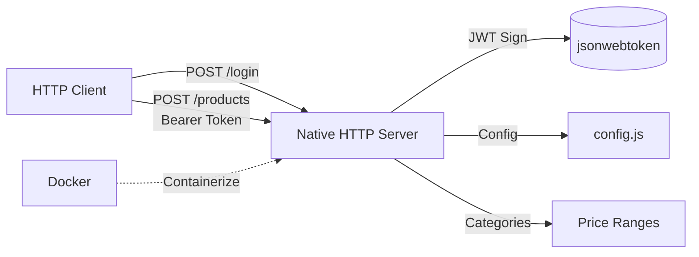

# Native Node.js API Test

[](https://nodejs.org/)
[](LICENSE)
[](https://nodejs.org/api/test.html)
[](https://www.docker.com/)

> **Minimal REST API for product categorization with JWT authentication** — Built with zero framework dependencies using only Node.js native modules.

---

## 🏗️ Architecture Overview



**Tech Stack:**
- **Runtime:** Node.js 20+ (ESM)
- **HTTP:** `node:http` + `node:events` (native)
- **Auth:** `jsonwebtoken` (HS256)
- **Testing:** `node:test` (native runner)
- **Container:** Docker + docker-compose

---

## 🚀 Quick Start

### Local Development

```bash
# Install dependencies
npm install

# Run tests
npm test

# Start development server (auto-reload)
npm run dev

# Run tests in watch mode
npm run test:dev
```

### Docker

```bash
# Build and run (runs tests first, then starts server)
docker-compose up --build

# Or manually
docker build -t native-node-api .
docker run -p 3000:3000 native-node-api
```

**Server runs at:** `http://localhost:3000`

---

## 📡 API Documentation

### Base URL
```
http://localhost:3000
```

### Authentication

All endpoints except `/login` require a **Bearer Token** in the Authorization header:

```http
Authorization: Bearer <your-jwt-token>
```

---

### 1. Login — Obtain JWT

```http
POST /login
Content-Type: application/json

{
  "user": "Samuel",
  "password": "123"
}
```

**Success Response (200):**
```json
{
  "token": "eyJhbGciOiJIUzI1NiIsInR5cCI6IkpXVCJ9.eyJ1c2VyIjoiU2FtdWVsIiwibWVzc2FnZSI6ImhleWR1dWRlIiwiaWF0IjoxNz...}"
}
```

**Error Response (400):**
```json
{
  "error": "user invalida"
}
```

---

### 2. Create Product — Categorize by Price

```http
POST /products
Content-Type: application/json
Authorization: Bearer <token>

{
  "description": "Premium Cookie",
  "price": 110
}
```

**Success Response (200):**
```json
{
  "category": "premium"
}
```

**Error Responses:**
| Status | Body | Cause |
|--------|------|-------|
| 400 | `invalid token!` | Missing/invalid/expired token |
| 404 | `not found!` | Wrong endpoint/method |

---

### Product Categories

| Category | Price Range | Example |
|----------|-------------|---------|
| `basic` | 0 – 50 | `{ "price": 10 }` → `"basic"` |
| `regular` | 51 – 100 | `{ "price": 60 }` → `"regular"` |
| `premium` | 101 – 500 | `{ "price": 110 }` → `"premium"` |

> ⚠️ Prices outside 0–500 return `{ "category": undefined }` (known limitation)

---

## 🧪 Testing

### Run All Tests
```bash
npm test
```

### Watch Mode
```bash
npm run test:dev
```

### Test Coverage
```
✓ API Products Test Suit
  ✓ It should create a premium product (price: 110)
  ✓ It should create a regular product (price: 60)
  ✓ It should create a basic product (price: 10)
```

### Test Structure
| File | Type | Coverage |
|------|------|----------|
| `app/api.test.js` | Integration | Login + 3 categorization cases |

**Current Coverage:** ~15% (happy paths only)

**Missing Test Cases:** See [Testing Documentation](./docs/testing.md#missing-edge-cases)

---

## ⚙️ Configuration

### Current (Hardcoded — `app/config/config.js`)
```javascript
export const VALID = { user: "Samuel", password: "123" };
export const TOKEN_KEY = "dsffaiu40238";
export const BASE_URL = "http://localhost:3000";
```

### Environment Variables (Recommended for Production)
| Variable | Description | Default |
|----------|-------------|---------|
| `JWT_SECRET` | JWT signing secret (min 32 chars) | — |
| `JWT_EXPIRES_IN` | Token lifetime (e.g., `1h`, `7d`) | `1h` |
| `VALID_USER` | Valid username | `admin` |
| `VALID_PASS` | Valid password | — |
| `PORT` | Server port | `3000` |
| `HOST` | Bind address | `0.0.0.0` |

---

## 🐳 Deployment

### Dockerfile
```dockerfile
FROM node:20-alpine
WORKDIR /home/node/app
COPY . ./
RUN npm install
USER node
CMD ["npm", "run", "docker:startup"]
EXPOSE 3000
```

### docker-compose.yaml
```yaml
version: '3'
services:
  app:
    build: .
    ports:
      - "3000:3000"
    volumes:
      - .:/home/node/app
```

### Production Checklist
- [ ] Set all environment variables (never commit secrets)
- [ ] Use strong JWT secret (32+ random bytes)
- [ ] Enable JWT expiration (`JWT_EXPIRES_IN`)
- [ ] Add reverse proxy (nginx/Traefik) with TLS
- [ ] Add health check endpoint
- [ ] Configure logging aggregation
- [ ] Run security scan (`docker scout`, `trivy`)

---

## 📁 Project Structure

```
native_node_api_test/
├── app/
│   ├── api.js              # HTTP server, routing, auth, handlers
│   ├── api.test.js         # Integration tests (native test runner)
│   ├── config/
│   │   ├── config.js       # Credentials, JWT secret, base URL
│   │   └── errors.js       # Error message constants
│   └── util/
│       └── utils.js        # Test helper: fetch wrapper
├── docs/
│   ├── architecture.md     # System architecture, ADRs, diagrams
│   ├── implementation.md   # Code analysis, refactoring guide
│   ├── testing.md          # Test strategy, coverage, gaps
│   └── security-audit.md   # Vulnerability assessment, remediation
├── Dockerfile              # Container build
├── docker-compose.yaml     # Local orchestration
├── package.json            # Manifest, scripts, dependencies
├── package-lock.json       # Lockfile
├── .gitignore              # Git ignore rules
├── LICENSE                 # MIT License
└── README.md               # This file
```

---

## 🔒 Security Considerations

> **⚠️ CRITICAL: This prototype has severe security vulnerabilities. Do not deploy to production without remediation.**

| Severity | Issue | Location |
|----------|-------|----------|
| 🔴 Critical | Hardcoded JWT secret in source | `config.js:6` |
| 🔴 Critical | Hardcoded plaintext credentials | `config.js:2-4` |
| 🔴 Critical | No token expiration | `api.js:17` |
| 🔴 Critical | No input validation (crash on malformed JSON) | `api.js:11,24` |
| 🟠 High | No rate limiting | — |
| 🟠 High | Stack traces leaked to console | `api.js:56` |

**Full Audit:** [Security Audit Report](./docs/security-audit.md)

### Immediate Remediation (Phase 0)
```bash
# 1. Generate strong secret
node -e "console.log(require('crypto').randomBytes(32).toString('hex'))"

# 2. Set as environment variable
export JWT_SECRET="your-generated-secret"
export VALID_USER="your-user"
export VALID_PASS="strong-password"
export JWT_EXPIRES_IN="1h"
```

---

## 🤝 Contributing

1. Fork the repository
2. Create feature branch: `git checkout -b feature/amazing-feature`
3. Run tests: `npm test`
4. Commit changes: `git commit -m 'feat: add amazing feature'`
5. Push branch: `git push origin feature/amazing-feature`
6. Open Pull Request

**Code Style:** No linter configured yet. Follow existing patterns.

---

## 📚 Documentation

| Document | Description |
|----------|-------------|
| [Architecture](./docs/architecture.md) | System design, ADRs, diagrams, data flows |
| [Implementation](./docs/implementation.md) | Code analysis, refactoring, tech debt |
| [Testing](./docs/testing.md) | Test strategy, coverage, missing cases |
| [Security Audit](./docs/security-audit.md) | Vulnerabilities, compliance, remediation |

---

## 📄 License

MIT License — Copyright (c) 2023 Samuel Ricardo

See [LICENSE](LICENSE) for full text.

---

## 🙏 Acknowledgments

- Built as a learning exercise for native Node.js HTTP APIs
- Inspired by minimalist backend architectures
- Uses [jsonwebtoken](https://github.com/auth0/node-jsonwebtoken) for JWT