# Testing Strategy & Code Quality Analysis

**Project:** native_node_api_test  
**Date:** 2025-08-25  
**Analyzer:** Carla QA Engineer  

---

## 1. Test Strategy Overview

### Test Runner
- **Framework:** Native Node.js test runner (`node --test`)
- **No external dependencies** — uses `node:test` and `node:assert`
- **Execution:** `npm test` runs `node --test .`
- **Watch mode:** `npm run test:dev` for TDD workflow

### Test Organization
```
app/
├── api.js          # Main HTTP server (source)
├── api.test.js     # Test suite (single file)
├── config/
│   ├── config.js   # Hardcoded secrets & constants
│   └── errors.js   # Error messages
└── util/
    └── utils.js    # HTTP helper (postRequest)
```

### Current Test Structure
```javascript
describe('API Products Test Suit', () => {
  let _server = {}
  let _globalToken = ''

  before(async () => { /* start server */ })
  before(async () => { /* login & set global token */ })

  it('should create a premium product', ...)
  it('should create a regular product', ...)
  it('should create a basic product', ...)

  after(done => _server.close(done))
})
```

### Test Execution Flow
1. Import and start HTTP server on port 3000
2. POST `/login` with hardcoded credentials → extract JWT
3. Store token in **global variable** (`_globalToken`)
4. Run 3 product categorization tests using shared token
5. Close server

---

## 2. Test Coverage Analysis

### Current Coverage: ~15% (Estimated)

| Component | Lines | Covered | Missing |
|-----------|-------|---------|---------|
| `api.js` - loginRoute | ~15 | ✅ Happy path | Invalid credentials, malformed JSON, missing fields |
| `api.js` - createProductRoute | ~25 | ✅ 3 categories | Boundary values, invalid price, missing fields, negative price |
| `api.js` - validateHeaders | ~15 | ⚠️ Indirect | Invalid token, missing header, expired token, malformed token |
| `api.js` - handler (routing) | ~20 | ⚠️ Partial | 404 routes, wrong methods, /login GET |
| `utils.js` - postRequest | ~10 | ✅ Used | Network errors, timeout, non-JSON response |

### Test Gaps Identified

| Category | Missing Tests |
|----------|---------------|
| **Authentication** | Invalid credentials, missing fields, empty body, SQL injection attempts |
| **Authorization** | Missing token, invalid token, expired token, malformed Bearer header |
| **Product Creation** | Boundary prices (0, 50, 51, 100, 101, 500, 501), negative price, zero price, string price, missing description, missing price, empty description |
| **Error Handling** | Malformed JSON in request body, server errors, network failures |
| **Routing** | GET /login, POST /unknown, PUT /products, DELETE /products |
| **Security** | Rate limiting, token replay, token tampering |

---

## 3. Test Quality Assessment

### Strengths
- Uses native test runner (no external deps)
- Tests use real HTTP server (integration style)
- Descriptive test names
- Uses `deepStrictEqual` for precise assertions

### Critical Issues

| Issue | Severity | Location |
|-------|----------|----------|
| **Global shared state** (`_globalToken`) | High | `api.test.js:6` |
| **No test isolation** — tests depend on login success | High | `before()` hook |
| **No cleanup between tests** | Medium | Entire suite |
| **Single test file** — no modular organization | Medium | Project structure |
| **No negative test cases** | Critical | Entire suite |
| **No boundary value testing** | Critical | Product categorization |
| **Hardcoded test data** in config | Medium | `config.js` |
| **No assertion on error responses** | High | Only 200 tested |
| **No timeout handling** | Medium | `postRequest` |
| **Tests not parallelizable** | Medium | Shared server/token |

### Test Reliability Concerns
- **Flaky:** Tests depend on server startup timing
- **Order-dependent:** Token must be acquired before product tests
- **No retries:** Network failures cause false negatives
- **No mocking:** All tests are integration tests (slow, brittle)

---

## 4. Test Cases Documentation

### Existing Tests

| Test | Purpose | Input | Expected Output |
|------|---------|-------|-----------------|
| `should create a premium product` | Verify premium categorization | `{description: "cookie - premiun", price: 110}` | `{category: "premium"}` |
| `should create a regular product` | Verify regular categorization | `{description: "cookie :D", price: 60}` | `{category: "regular"}` |
| `should create a basic product` | Verify basic categorization | `{description: "cookie - basic", price: 10}` | `{category: "basic"}` |

### Implicit Test (Login in `before` hook)
| Purpose | Input | Expected Output |
|---------|-------|-----------------|
| Authenticate valid user | `{user: "Samuel", password: "123"}` | `{token: "jwt.string.here"}` |

---

## 5. Edge Cases Missing

### Authentication Edge Cases
| Scenario | Input | Expected |
|----------|-------|----------|
| Invalid username | `{user: "wrong", password: "123"}` | 400 + `INVALID_USER_ERROR` |
| Invalid password | `{user: "Samuel", password: "wrong"}` | 400 + `INVALID_USER_ERROR` |
| Missing user field | `{password: "123"}` | 400 (JSON parse error or validation) |
| Missing password field | `{user: "Samuel"}` | 400 |
| Empty request body | `{}` | 400 |
| Malformed JSON | `"not json"` | 400 / 500 |
| SQL injection attempt | `{user: "admin'--", password: "x"}` | 400 (safe handling) |
| Very long strings | `{user: "a".repeat(10000), ...}` | 400 (DoS prevention) |

### Authorization Edge Cases
| Scenario | Header | Expected |
|----------|--------|----------|
| Missing Authorization | (none) | 400 + "invalid token!" |
| Empty Bearer token | `Authorization: Bearer ` | 400 |
| Invalid JWT signature | `Bearer invalid.token.here` | 400 |
| Expired token | `Bearer <expired-jwt>` | 400 |
| Token without Bearer prefix | `Authorization: invalidtoken` | 400 (regex removes "bearer") |
| Case variations | `authorization: bearer token` | Should work (regex is case-insensitive) |
| Multiple auth headers | `Authorization: Bearer t1, Bearer t2` | Undefined behavior |

### Product Creation Edge Cases
| Scenario | Input | Expected |
|----------|-------|----------|
| Price = 0 (boundary) | `{price: 0}` | `"basic"` |
| Price = 50 (boundary) | `{price: 50}` | `"basic"` |
| Price = 51 (boundary) | `{price: 51}` | `"regular"` |
| Price = 100 (boundary) | `{price: 100}` | `"regular"` |
| Price = 101 (boundary) | `{price: 101}` | `"premium"` |
| Price = 500 (boundary) | `{price: 500}` | `"premium"` |
| Price = 501 (out of range) | `{price: 501}` | `undefined` category (bug!) |
| Negative price | `{price: -10}` | Should reject (currently `"basic"`) |
| Float price | `{price: 50.5}` | `"regular"` (works) |
| String price | `{price: "100"}` | Coerced? (JS `>=` coerces) |
| Missing price | `{description: "test"}` | `NaN` comparison → `undefined` category |
| Missing description | `{price: 100}` | Works (description unused) |
| Empty description | `{description: "", price: 100}` | Works |
| Very large price | `{price: 1e10}` | `undefined` category |
| Non-numeric price | `{price: "abc"}` | `NaN` → `undefined` category |

### Routing Edge Cases
| Scenario | Method + URL | Expected |
|----------|--------------|----------|
| GET /login | `GET /login` | 404 (not found) |
| POST /unknown | `POST /unknown` | 404 |
| PUT /products | `PUT /products` | 404 |
| DELETE /products | `DELETE /products` | 404 |
| POST /products (no auth) | No header | 400 |

---

## 6. Code Quality Issues

### Critical Security Vulnerabilities

| Issue | File | Line | Description |
|-------|------|------|-------------|
| **Hardcoded JWT Secret** | `config.js:6` | `TOKEN_KEY = "dsffaiu40238"` | Secret in source control, no rotation |
| **Hardcoded Credentials** | `config.js:3-5` | `user: "Samuel", password: "123"` | Plaintext password, no hashing |
| **No Password Hashing** | `api.js:10-13` | Direct comparison | Passwords stored/compared in plaintext |
| **No Input Validation** | `api.js:9, 22` | `JSON.parse` without try/catch | Crash on malformed JSON |
| **No Rate Limiting** | `api.js` | Entire handler | Unlimited login/product attempts |
| **Error Info Leakage** | `api.js:47` | `console.error(err)` | Stack traces to console |
| **JWT No Expiration** | `api.js:17` | `jwt.sign({...}, TOKEN_KEY)` | Tokens never expire |
| **Insecure Defaults** | `config.js` | Weak secret, weak password | Default credentials in code |

### Code Quality Issues

| Issue | File | Description |
|-------|------|-------------|
| **No TypeScript** | Entire project | No type safety, no IDE support |
| **No ESLint/Prettier** | Missing config | No code style enforcement |
| **Magic Numbers** | `api.js:25-33` | Category boundaries hardcoded |
| **Unused Variable** | `api.js:22` | `description` parsed but never used |
| **Inconsistent Error Codes** | `api.js` | 400 for auth, 400 for invalid user, 404 for not found |
| **No Request Size Limit** | `api.js:9, 22` | `once(request, "data")` reads entire body |
| **No Helmet/Security Headers** | `api.js` | No CSP, HSTS, X-Frame-Options |
| **Console.log in Production** | `api.js:55` | `console.log("listening to 3000")` |
| **Synchronous JWT Verify** | `api.js:44` | `jwt.verify` blocks event loop |

---

## 7. Static Analysis Recommendations

### ESLint Configuration (`.eslintrc.json`)
```json
{
  "env": { "node": true, "es2022": true },
  "parserOptions": { "ecmaVersion": "latest", "sourceType": "module" },
  "rules": {
    "no-console": "warn",
    "no-unused-vars": "error",
    "require-await": "error",
    "no-await-in-loop": "warn",
    "prefer-const": "error",
    "no-var": "error",
    "eqeqeq": ["error", "always"],
    "curly": ["error", "all"],
    "no-eval": "error",
    "no-implied-eval": "error",
    "no-new-func": "error"
  }
}
```

### TypeScript Migration (`tsconfig.json`)
```json
{
  "compilerOptions": {
    "target": "ES2022",
    "module": "NodeNext",
    "moduleResolution": "NodeNext",
    "lib": ["ES2022"],
    "strict": true,
    "esModuleInterop": true,
    "skipLibCheck": true,
    "forceConsistentCasingInFileNames": true,
    "resolveJsonModule": true,
    "declaration": true,
    "outDir": "./dist",
    "rootDir": "./app"
  },
  "include": ["app/**/*"],
  "exclude": ["node_modules", "dist"]
}
```

### Semgrep Rules (`.semgrep.yml`)
```yaml
rules:
  - id: hardcoded-jwt-secret
    pattern-either:
      - pattern: $X = "..."
        metavariable-regex:
          metavariable: $X
          regex: "(TOKEN_KEY|JWT_SECRET|SECRET_KEY)"
    message: "Hardcoded JWT secret detected"
    severity: ERROR
    languages: [javascript, typescript]

  - id: hardcoded-credentials
    pattern-either:
      - pattern: $OBJ = { user: "...", password: "..." }
    message: "Hardcoded credentials detected"
    severity: ERROR
    languages: [javascript, typescript]

  - id: missing-input-validation
    pattern: JSON.parse($DATA)
    message: "JSON.parse without try/catch - add validation"
    severity: WARNING
    languages: [javascript, typescript]

  - id: console-error-production
    pattern: console.error($ERR)
    message: "console.error in production code - use proper logger"
    severity: WARNING
    languages: [javascript, typescript]

  - id: jwt-without-expiry
    pattern: jwt.sign($PAYLOAD, $SECRET)
    message: "JWT sign without expiresIn option"
    severity: WARNING
    languages: [javascript, typescript]

  - id: sync-crypto-operation
    pattern: jwt.verify($TOKEN, $SECRET)
    message: "Synchronous JWT verify blocks event loop - use async"
    severity: WARNING
    languages: [javascript, typescript]
```

### Recommended CI Checks
```yaml
# .github/workflows/ci.yml
- name: Lint
  run: npx eslint app/
- name: Type Check
  run: npx tsc --noEmit
- name: Semgrep Scan
  run: npx semgrep scan --config=.semgrep.yml
- name: Tests
  run: npm test
- name: Audit
  run: npm audit --audit-level=high
```

---

## 8. CI/CD Testing Pipeline

### Recommended Pipeline Stages

```mermaid
graph LR
    A[Code Push] --> B[Install Dependencies]
    B --> C[Static Analysis]
    C --> D[Type Check]
    D --> E[Unit Tests]
    E --> F[Integration Tests]
    F --> G[Security Scan]
    G --> H[Build Docker]
    H --> I[Deploy to Staging]
    I --> J[E2E Tests]
    J --> K[Deploy to Prod]
```



### GitHub Actions Example
```yaml
name: CI/CD Pipeline

on: [push, pull_request]

jobs:
  test:
    runs-on: ubuntu-latest
    steps:
      - uses: actions/checkout@v4
      - uses: actions/setup-node@v4
        with:
          node-version: '20'
          cache: 'npm'
      
      - name: Install
        run: npm ci
      
      - name: Lint
        run: npx eslint app/
      
      - name: Type Check
        run: npx tsc --noEmit
      
      - name: Semgrep Security Scan
        run: npx semgrep scan --config=.semgrep.yml --error
      
      - name: Run Tests
        run: npm test
      
      - name: Coverage
        run: npm test -- --experimental-test-coverage
      
      - name: Upload Coverage
        uses: codecov/codecov-action@v3
        if: always()
```

### Test Coverage Thresholds
```json
// package.json addition
"coverage": {
  "thresholds": {
    "lines": 80,
    "functions": 80,
    "branches": 70,
    "statements": 80
  }
}
```

---

## 9. Test Improvement Plan

### Priority 1: Critical (Do First)
| # | Task | Effort | Impact |
|---|------|--------|--------|
| 1 | Add boundary value tests (0, 50, 51, 100, 101, 500, 501) | 2h | High |
| 2 | Add negative auth tests (invalid token, missing token, expired) | 2h | High |
| 3 | Add login failure tests (wrong creds, missing fields, malformed JSON) | 2h | High |
| 4 | Fix test isolation — remove global token, login per test | 3h | High |
| 5 | Add test for price > 500 (currently returns undefined) | 1h | High |

### Priority 2: High (Do Next)
| # | Task | Effort | Impact |
|---|------|--------|--------|
| 6 | Add input validation tests (negative price, string price, NaN) | 2h | High |
| 7 | Add routing tests (404, wrong methods, GET /login) | 1h | Medium |
| 8 | Add error response assertions (check status codes, error messages) | 2h | Medium |
| 9 | Refactor tests into separate files (auth.test.js, products.test.js) | 3h | Medium |
| 10 | Add test utilities/fixtures for token generation | 2h | Medium |

### Priority 3: Medium (Technical Debt)
| # | Task | Effort | Impact |
|---|------|--------|--------|
| 11 | Migrate to TypeScript with strict mode | 8h | High |
| 12 | Add ESLint + Prettier + Husky pre-commit | 4h | Medium |
| 13 | Add Semgrep security rules to CI | 2h | High |
| 14 | Implement request validation middleware | 4h | High |
| 15 | Add rate limiting (express-rate-limit or custom) | 3h | High |
| 16 | Add JWT expiration & refresh token flow | 4h | High |
| 17 | Replace console.error with proper logger (pino/winston) | 2h | Medium |

### Priority 4: Long-term
| # | Task | Effort | Impact |
|---|------|--------|--------|
| 18 | Add contract testing (Pact) for API consumers | 8h | Medium |
| 19 | Add load testing (k6/artillery) | 4h | Medium |
| 20 | Add mutation testing (Stryker) | 4h | Low |
| 21 | Add visual regression (if UI added) | N/A | N/A |
| 22 | Document API with OpenAPI/Swagger | 4h | Medium |

### Test Coverage Targets
| Phase | Target | Timeline |
|-------|--------|----------|
| Phase 1 (Critical) | 50% | Week 1 |
| Phase 2 (High) | 70% | Week 2 |
| Phase 3 (Medium) | 85% | Week 4 |
| Phase 4 (Long-term) | 90%+ | Ongoing |

---

## Summary

**Current State:** Minimal test coverage (~15%), no negative testing, critical security vulnerabilities, no static analysis.

**Immediate Actions Required:**
1. Fix hardcoded secrets (move to env vars)
2. Add input validation & error handling
3. Implement boundary value tests
4. Add authentication/authorization negative tests
5. Remove global test state

**Risk Level:** **HIGH** — Production deployment not recommended without Priority 1 fixes.

---

*Generated by Carla QA Engineer — Adversarial Testing Division*  
*Review date: 2025-08-25 | Next review: After Priority 1 implementation*